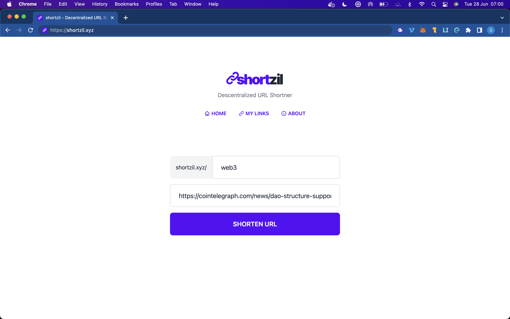
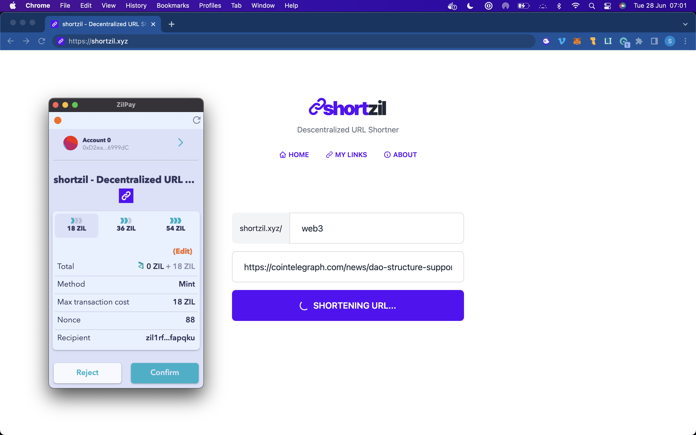
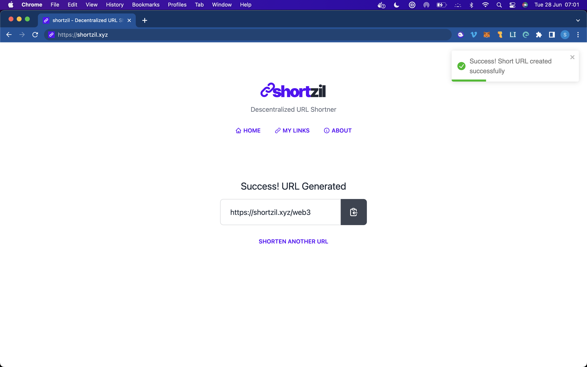
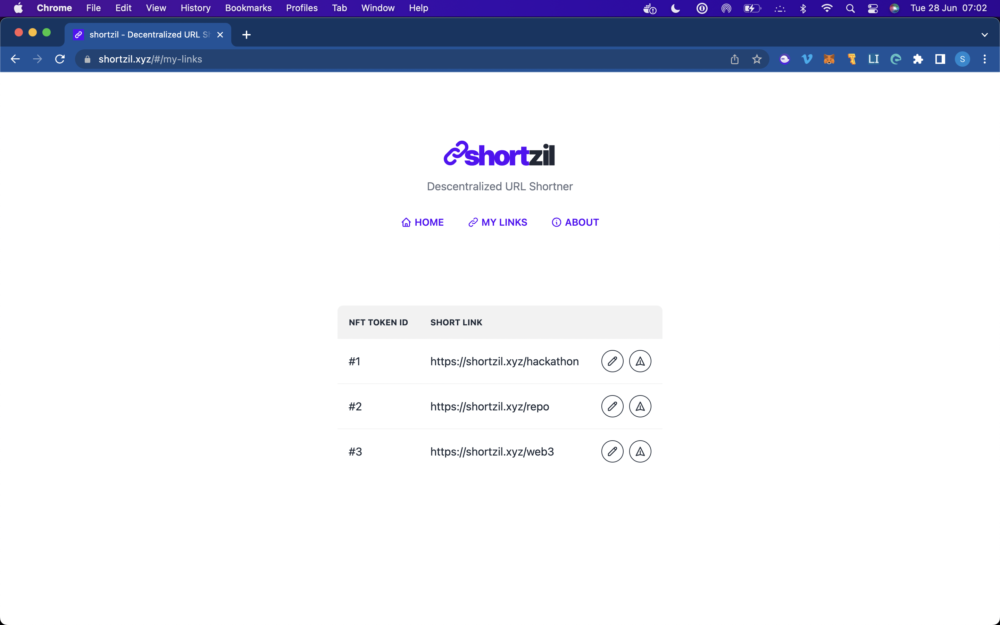

# shortzil

### About

Link Shortner + Blockchain + Zilliqa + NFTS = shortzil

The shortzil was developed for the Zilliqa Open Track Challenge. You can see more details here: https://shortzil.xyz/hackathon

The main idea is that anyone can reserve a unique name (slug) to shorten a url. Once a person generates a shortened link, they have ownership of that slug and only they can change the shortened link URL. As this slug is an NFT, it can be transferred to someone else or even sold on a marketplace.

### Quick Links

- ⚡️ Live Demo: [https://shortzil.xyz](https://shortzil.xyz)

- 📄 Smart Contract: [https://shortzil.xyz/contract](https://facebook.github.io/create-react-app/docs/running-tests)

### Screenshots

